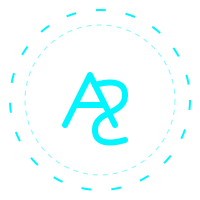
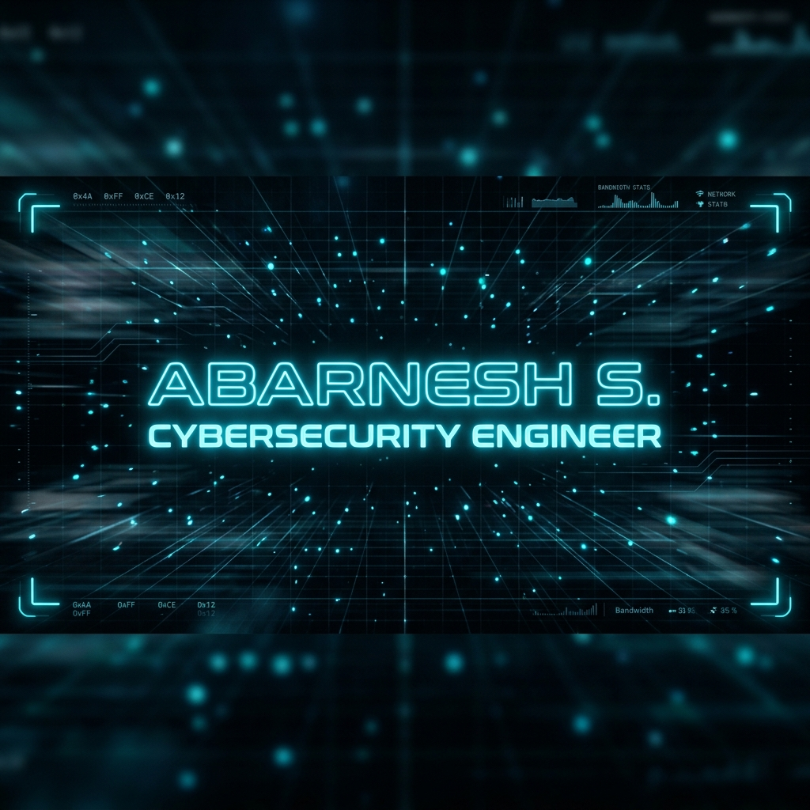

<div align="center">

<!-- LOGO & HERO SECTION -->
<p align="center">
  
</p>




<br/>

<!-- AVATAR & FAKE GLOW -->
<p align="center">
  
  <br/><br/>
  ✨ ⚡ <b>ABARNESH S.</b> ⚡ ✨
</p>

<br/>

<!-- LIVE SYSTEM STATUS PANEL -->
<div align="center">
<pre>
┏━━━━━━━━━━━━━━━━━━━━━━━━━━━━━━━━━━━━━━━━━━━━━━━━━━━━━━━━━━━━━━━━━━━━━━━━━━━━━━━━━━━━━━━━┓
┃  <b>STATUS:</b> <font color="#00f5ff">ONLINE</font>             <b>AI CORE:</b> ACTIVE             <b>NETWORK:</b> STABLE         ┃
┃  <b>THREAT LEVEL:</b> <font color="#ff0000">LOW</font>      <b>MODE:</b> DEFENSIVE             <b>LOCATION:</b> 11.0°N, 76.9°E  ┃
┗━━━━━━━━━━━━━━━━━━━━━━━━━━━━━━━━━━━━━━━━━━━━━━━━━━━━━━━━━━━━━━━━━━━━━━━━━━━━━━━━━━━━━━━━┛
</pre>
</div>

<br/>

───── 🛡️ <b>CORE ARSENAL</b> ─────

<table width="100%">
  <tr>
    <td width="33.3%" valign="top" align="center">
      <h4><font color="#00f5ff">◈ SECURITY</font></h4>
      <br/>
      <br/>
      <br/>
      
    </td>
    <td width="33.3%" valign="top" align="center">
      <h4><font color="#00f5ff">◈ FRONTEND</font></h4>
      <br/>
      <br/>
      <br/>
      
    </td>
    <td width="33.3%" valign="top" align="center">
      <h4><font color="#00f5ff">◈ BACKEND</font></h4>
      <br/>
      <br/>
      <br/>
      
    </td>
  </tr>
</table>

<br/>

───── 🚀 <b>MISSION LOGS</b> ─────

<table width="100%">
  <tr>
    <td align="left">
      <h3><font color="#00f5ff">[MISSION 01]</font> DATA_REDACTION_CORE</h3>
      <p>Deployment of a high-precision PII masking engine using EasyOCR and OpenCV. Achieved 95%+ detection rate.</p>
      <code><b>STATUS:</b> DEPLOYED</code> | <code><b>TECH:</b> PYTHON / OCR</code>
    </td>
  </tr>
  <tr>
    <td align="left">
      <h3><font color="#00f5ff">[MISSION 02]</font> CIVIC_AI_SHIELD</h3>
      <p>Real-time threat detection network. Computer vision analysis for anomalies and automated emergency protocols.</p>
      <code><b>STATUS:</b> ACTIVE</code> | <code><b>TECH:</b> PyTorch / React</code>
    </td>
  </tr>
</table>

<br/>

───── 📈 <b>CONTRIBUTION MATRIX</b> ─────

<p align="center">
  
</p>

<br/>

───── 📊 <b>ANALYTICS HUD</b> ─────

<p align="center">
  
  
</p>

<br/>

───── ⌨️ <b>LIVE SYSTEM LOG</b> ─────

```bash
[13:21:04] [SYS] BOOTING KERNEL_JARVIS_v3...
[13:21:05] [AI] NEURAL CHANNELS: OPERATIONAL
[13:21:06] [SEC] FIREWALLS: STEALTH_MODE
[13:21:07] [NET] GLOBAL TUNNEL: STABLE
[13:21:08] [SYS] SCANNING FOR RECENT ACTIVITY...

> whoami
Abarnesh S. | Cybersecurity Architect & Full Stack Developer

> status --continuous
[MONITORING] Incoming traffic...
[TRACKING] Active sessions...
[SCANNING] Repository integrity...

[AWAITING COMMAND...]
> _
```

<br/>

───── 🔥 <b>RECENT ACTIVITY</b> ─────

```bash
> booting system...
> fetching latest commits...
> status: ACTIVE
> _
```

<br/>

───── 📡 <b>SECURE CHANNEL</b> ─────

<div align="center">

[](https://linkedin.com/in/abarnesh)
[](https://github.com/abarnesh01)
[](mailto:abarnesh772@gmail.com)

<br/><br/>

<b><font color="#00f5ff">-- JARVIS ACTIVE --</font></b>
<br/>


</div>
